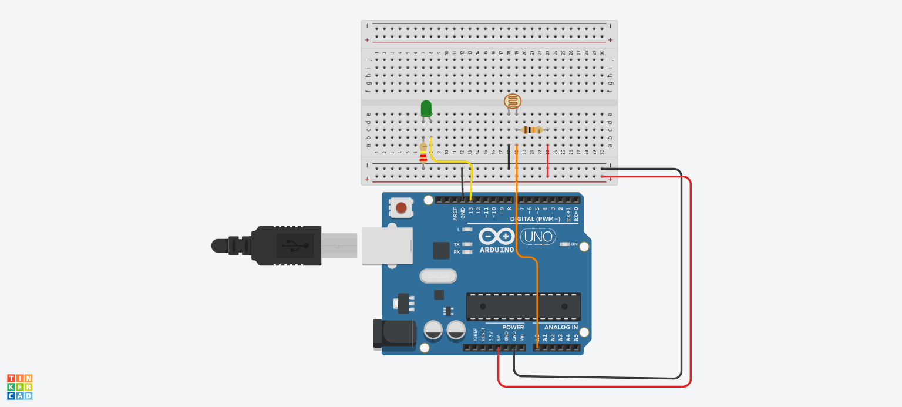

# Automatic Lighting System (LDR + Arduino)

An automated light sensing system designed in Tinkercad using an Arduino Uno, Light Dependent Resistor (LDR), and LED.

## 📌 Project Overview
This system automatically turns ON an LED when ambient light drops below a threshold (simulating nighttime) and turns it OFF in bright light (simulating daytime).

## 🛠️ Components Used
- 1x Arduino Uno R3
- 1x Photoresistor (LDR)
- 1x LED
- 1x 10kΩ Resistor (Pull-down for LDR)
- 1x 220Ω Resistor (Current limiter for LED)
- 1x Small Breadboard & Jumper Wires

## ⚡ Circuit Schematic

## 🚀 How to Run
1. Open [Tinkercad Circuits](https://www.tinkercad.com).
2. Build the circuit as shown in the diagram above.
3. Paste the contents of `main.ino` into the Text Code editor.
4. Click **Start Simulation** and move the photoresistor slider to test!
